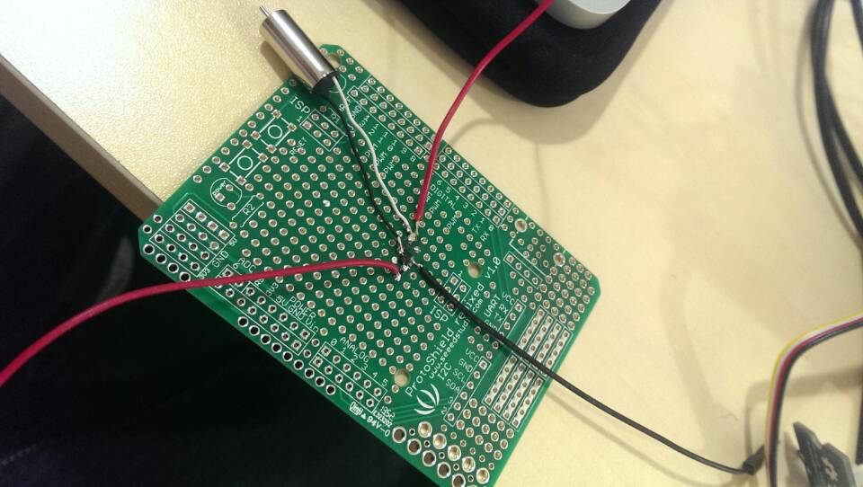

# 於 ARM mbed 上控制直流有刷馬達
直流有刷馬達好處在為控制速度方面比較簡單，可以在不受電源頻率的限制下，使用電壓大小控制轉速。而本篇即要透過此方法展示使用 PwmOut 來控制直流有刷馬達。本文使用的[馬達為此](http://www.seeedstudio.com/depot/Crazyflie-20-Spare-7x16-mm-coreless-DC-motor-with-connector-p-2115.html)。


## 控制電路


圖1 馬達控制電路


依照此電路圖可以選擇自己手焊或者使用 Mini Fan 電路板來連接馬達。




圖2 手焊電路


圖3 Mini Fan 電路板


## 腳位接法

由於 LPC1768 有電路保護，因此馬達的供應電源需要再額外供應。

| Motor pin | Mbed pin   |
| --------- | ---------- |
| 1 - Pwm   | P21 - SCL  |
| 3 - Vcc   | Vout - 3.3V|
| 4 - GND   | GND        |


## 程式碼

開始撰寫 ARM mbed 程式碼。首先，必須引入 mbed.h 標頭檔，接著將連接腳位(這邊要特別注意馬達的腳位宣告要使用 PwmOut)。並且我們利用 LED 燈來表示轉速的變化。


```
#include "mbed.h"

DigitalOut ledForPower1(LED1);
DigitalOut ledForPower2(LED2);
DigitalOut ledForPower3(LED3);
DigitalOut ledForPower4(LED4);
PwmOut motor(p21);

int main() {
        
        motor=0;
        wait(2);
        
        motor=0.4;
        ledForPower1=1;
        wait(2);
        
        motor=0.6;
        ledForPower2=1;
        wait(2);
        
        motor=0.8;
        ledForPower3=1;
        wait(2);
        
        motor=1;
        ledForPower4=1;
    
}

```

## 參考資料
* http://www.seeedstudio.com/wiki/images/5/5b/Grove_-_Mini_Fan_v1.0.pdf
* http://www.shs.edu.tw/works/essay/2008/10/2008102923422666.pdf
